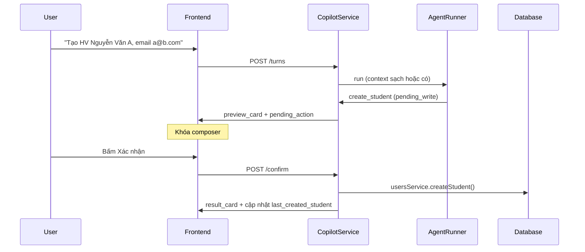

# Yêu cầu sửa lại Agent AI (Copilot mini) — đối chiếu thiết kế FluentGo

**Dự án:** `/Users/tuna/Documents/cobinot` (Hxstu)  
**Tham chiếu thiết kế:** FluentGo Frontend — Admin Copilot
**Ngày lập:** 06/07/2026  
**Đối tượng:** 

---
## 1. Phạm vi bản mini (3 nghiệp vụ)
## 2. Đánh giá hiện trạng
## 3. Thiết kế chuẩn FluentGo (session phases, preview → confirm, API payload)
## 4. 17 mục cần sửa theo P0 → P4, kèm file path và code mẫu
## 5. Sequence diagram luồng chuẩn cho 3 nghiệp vụ
## 6. Checklist nghiệm thu
## 7. Lộ trình 3 tuần + bảng file cần sửa
---

## 1. Phạm vi bản mini (yêu cầu gốc)

Agent mini **chỉ** cần hỗ trợ 3 nghiệp vụ:

| # | Nghiệp vụ | Mô tả ngắn |
|---|-----------|------------|
| 1 | **Tạo học viên** | Tạo hồ sơ học viên mới (tên, email, SĐT, …) |
| 2 | **Tạo khóa học** | Tạo khóa học mới (tên, loại, ngày bắt đầu/kết thúc, …) |
| 3 | **Thêm học viên vào khóa** | Ghi danh học viên vào khóa học đã có |

Mọi thay đổi phải tuân theo **luồng xác nhận (preview → confirm)** và **quản lý phiên** như FluentGo Copilot hiện tại — không tự ý thêm/xóa ngoài phạm vi nếu chưa được duyệt.

---

## 2. Đánh giá hiện trạng (~40% hoàn thành)

| Chức năng | Trạng thái | Ghi chú |
|-----------|------------|---------|
| Tạo học viên | ⚠️ Một phần | Tool + API chạy được nhưng **không có preview/confirm**; dễ nhầm với cập nhật học viên cũ |
| Tạo khóa học | ⚠️ Một phần | Tool chạy được; schema tool khai báo `startDate`/`endDate` nhưng **Course model không có field này** |
| Thêm HV vào khóa | ❌ Chưa đạt | Tool `assign_student_to_class` tồn tại nhưng luồng thực tế hay fail; FE tham chiếu tool không tồn tại; không có bước chọn khóa/lớp rõ ràng |
| Kết thúc phiên | ❌ Chưa đạt | API `closeSession` có nhưng FE không gọi; context cũ bị giữ khi tạo chat mới |
| Xác nhận trước khi ghi | ❌ Bị bypass | Runner trả `pending_write` nhưng `CopilotService` **thực thi ngay** |
| Xử lý trùng lặp / nhầm lẫn | ❌ Chưa có | Ví dụ: "thêm học viên abc@gmail.com" → tìm thấy email → **update đè** không hỏi user |

---

## 3. Thiết kế chuẩn FluentGo (bắt buộc tham chiếu)

### 3.1. Kiến trúc Copilot FluentGo

```
User gửi tin nhắn HOẶC tương tác block
        ↓
POST /tenant/agent/copilot/sessions/{id}/turns
        ↓
Response: { status, assistant_message: { text, blocks[] } }
        ↓
FE render block (preview_card, candidate_table, form, …)
        ↓
User bấm Xác nhận → interaction { type: 'block_action', action_id, payload }
        ↓
Backend thực thi (có idempotency_key)
```

**File tham chiếu chính (FluentGo):**

| Thành phần | Đường dẫn |
|------------|-----------|
| Hook session/turn | `fluentgo-fe/src/hooks/tenant/useCopilot.ts` |
| Types & phases | `fluentgo-fe/src/types/copilot.ts` |
| Block renderer | `fluentgo-fe/src/components/copilot/blocks/CopilotBlockRenderer.tsx` |
| Preview confirm | `fluentgo-fe/src/components/copilot/blocks/PreviewCardBlock.tsx` |
| Ghi danh | `fluentgo-fe/src/components/copilot/blocks/AssignEnrollmentFormBlock.tsx` |
| Tạo HV | `fluentgo-fe/src/components/copilot/blocks/StudentCreateFormBlock.tsx` |
| Tạo khóa | `fluentgo-fe/src/components/copilot/blocks/CourseCreateFormBlock.tsx` |

### 3.2. Session status & phase (FluentGo)

**Session status:** `active` → `need_selection` → `preview` → `executing` → `completed` / `failed`

**Phase:** `IDLE` → `DISAMBIGUATION` → `PREVIEW` → `COLLECT_ENROLLMENT` → `EXECUTING` → `DONE`

→ Composer **bị khóa** khi `preview` hoặc `executing`. User không gửi tin nhắn mới khi đang chờ xác nhận.

### 3.3. Luồng xác nhận bắt buộc

Mọi thao tác **ghi DB** (create / update / assign / delete) phải:

1. Agent chuẩn bị dữ liệu → trả **preview** (không ghi DB)
2. Lưu `pending_action` vào `session.state`
3. FE hiển thị card xác nhận (có thể chỉnh sửa trước khi confirm)
4. User bấm **Xác nhận** (`confirm_execute` / `POST .../confirm`) → mới gọi service ghi DB
5. User bấm **Hủy** (`cancel_pending` / `POST .../cancel`) → xóa `pending_action`, không ghi DB
6. Gửi kèm **`idempotency_key`** khi confirm để tránh double-submit

### 3.4. API nghiệp vụ FluentGo (payload chuẩn)

| Nghiệp vụ | API | Payload chính |
|-----------|-----|---------------|
| Tạo học viên | `POST /tenant/students` | `name`, `email`, `phone`, `note`, … |
| Tạo khóa | `POST /tenant/courses` | `name`, `type`, `start_date`, `expire_date`, `program_id`, … |
| Ghi danh | `POST /tenant/courses/{courseId}/assign-students` | `[{ student_id, expire_date, allow_late_payment? }]` |

**Lưu ý:** FluentGo ghi danh ở **cấp khóa học (Course)**, không bắt user chọn "lớp" (Class) trừ khi nghiệp vụ yêu cầu.

### 3.5. Xử lý trùng lặp / mơ hồ (FluentGo)

- Tìm thấy **nhiều kết quả** → block `candidate_table` / `student_match_picker` — user **chọn 1**
- Email/SĐT **đã tồn tại** khi tạo mới → **không tự update**; hỏi user: tạo mới khác / chọn HV có sẵn / hủy
- Intent không rõ "thêm" vs "sửa" → `ask_clarification` hoặc phase `DISAMBIGUATION`

---

## 4. Danh sách lỗi cần sửa (theo mức ưu tiên)

### P0 — Critical (phải sửa trước, chặn nghiệm thu)

#### 4.1. Bypass preview/confirm — ghi DB ngay lập tức

**Vấn đề:** `AgentRunnerService` trả `pending_write` (đúng thiết kế), nhưng `CopilotService.createTurn()` **gọi `toolRegistry.execute()` ngay** thay vì lưu pending và trả preview.

**File:** `apps/api/src/copilot/copilot.service.ts` (khoảng dòng 214–246)

**Hiện tại (sai):**
```typescript
if (result.type === 'pending_write') {
  const executeResult = await this.toolRegistry.execute(...); // ← thực thi ngay
  return { type: 'tool_result', message: 'Đã thực hiện xong.' };
}
```

**Yêu cầu sửa:**
```typescript
if (result.type === 'pending_write') {
  const nextState = mergeState(state, {
    pending_action: result.pendingAction,
    ...(result.contextPatch || {}),
  });
  return saveAssistantTurn({
    response: previewResponse(result.pendingAction), // type: 'preview_card'
    state: nextState,
  });
}
```

Chỉ thực thi trong `confirm()` / `POST .../confirm` — logic đã có sẵn nhưng không được dùng trên luồng chính.

**Nghiệm thu:** Tạo HV → phải thấy card preview → bấm Xác nhận mới có record trong DB.

---

#### 4.2. Suggestion action cũng bypass confirm

**File:** `apps/api/src/copilot/copilot.service.ts` (dòng 153–201)

**Vấn đề:** `pendingActionFromSuggestion(action)` thực thi tool ngay khi user click gợi ý, không qua preview.

**Yêu cầu:** Mọi write action từ suggestion cũng phải đi qua `pending_action` + preview card.

---

#### 4.3. Nhầm "thêm học viên" → update đè học viên cũ (không confirm)

**Vấn đề:** User nói "thêm học viên abc@gmail.com" → agent gọi `search_student` → thấy email trùng → gọi `update_student` thay vì tạo mới hoặc hỏi user.

**Nguyên nhân:**
- Không có rule backend chặn `update_student` khi intent là "tạo/thêm"
- Field `duplicate_student_context` trong state **được khai báo nhưng không bao giờ được set**
- Không có bước confirm khi phát hiện trùng email/SĐT

**Yêu cầu sửa:**

1. **Prompt** (`agent-context-builder.service.ts`): bổ sung rule rõ ràng:
   - Nếu user muốn **tạo/thêm** mà email/SĐT đã tồn tại → **bắt buộc** `ask_clarification` (không được gọi `update_student`)
   - Chỉ gọi `update_student` khi user **rõ ràng** nói "sửa", "cập nhật", "đổi tên", …

2. **Backend guard** trong `tool-registry.service.ts` hoặc `users.service.ts`:
   - Trước `update_student`: kiểm tra intent/session; nếu `last_intent` là `create_student` → reject + trả clarification

3. **Implement `duplicate_student_context`** trong state:
   ```typescript
   duplicate_student_context: {
     searched_email: string,
     existing_student: EntityOption,
     intended_action: 'create' | 'assign' | 'update',
   }
   ```
   → FE hiển thị card: "Email đã tồn tại. Bạn muốn: (1) Dùng HV có sẵn (2) Nhập email khác (3) Hủy"

4. Luôn qua **preview** trước khi update.

**Nghiệm thu:** "Tạo học viên email đã có" → hỏi lại, **không** tự sửa record cũ.

---

#### 4.4. Mâu thuẫn README / prompt / code

| Nguồn | Nói gì | Thực tế |
|-------|--------|---------|
| README | "preview rồi confirm" | Auto-execute |
| System prompt (dòng 16) | "hệ thống sẽ biến tool call thành preview chờ xác nhận" | Không đúng |
| `EditablePreviewCard.tsx` | UI preview đầy đủ | Hầu như không hiển thị |
| Test `copilot.service.spec.ts` | Test case "pending_write → execute ngay" | **Sai thiết kế** — cần sửa test |

**Yêu cầu:** Đồng bộ README, prompt, code, test theo luồng preview → confirm.

---

### P1 — Core features (3 chức năng mini)

#### 4.5. Thêm học viên vào khóa — chưa hoạt động ổn định

**Vấn đề cụ thể:**

1. **Mô hình dữ liệu lệch FluentGo:** Cobinot dùng `assign_student_to_class` (ghi danh vào **Lớp**), FluentGo dùng `assign-students` ở **cấp Khóa**. User nói "thêm vào khóa X" nhưng agent phải tự tìm class → dễ fail.

2. **FE tham chiếu tool không tồn tại:**
   - `assign_student_to_course` — **không có** trong `tool-definitions.ts`
   - `update_student_course_role`, `remove_student_from_course` — **không có**
   - File: `apps/web/src/app/copilot/page.tsx` (khoảng dòng 1917–1927)

3. **Không cập nhật context sau ghi danh thành công:** `statePatchFromToolResult()` không handle `assign_student_to_class`.

4. **Thiếu bước disambiguation:** Khi khóa có nhiều lớp, không có `selection_list` / `candidate_table` từ backend.

**Yêu cầu sửa (chọn 1 hướng, ưu tiên A):**

**Hướng A — Bám FluentGo (khuyến nghị cho bản mini):**
- Thêm tool `assign_student_to_course` với params: `userId`, `courseId`, `expireDate?`
- Backend gọi logic tương đương `POST /tenant/courses/{id}/assign-students`
- Nếu khóa có nhiều lớp: backend tự chọn lớp mặc định (lớp ACTIVE đầu tiên) HOẶC hỏi user qua `ask_clarification`
- Luồng: `search_student` → `search_course` → (disambiguation nếu cần) → **preview** → confirm → execute

**Hướng B — Giữ class-based:**
- Giữ `assign_student_to_class` nhưng bắt buộc luồng: tìm khóa → `get_course_classes` → nếu 1 lớp: auto; nếu nhiều lớp: `ask_clarification` với danh sách lớp
- FE sửa hết reference `assign_student_to_course` → `assign_student_to_class`

**Luồng chuẩn tham chiếu FluentGo** (`AssignEnrollmentFormBlock.tsx`):
```
DISAMBIGUATION (chọn HV + khóa)
  → COLLECT_ENROLLMENT (expire_date, allow_late_payment)
  → PREVIEW (preview_card)
  → EXECUTING
  → DONE (result_card)
```

**Nghiệm thu:**
- "Thêm Nguyễn Văn A vào khóa IELTS 6.5" → tìm đúng HV + khóa → preview → confirm → ghi danh thành công
- "Thêm HV vào khóa" (thiếu tên) → hỏi lại, không crash

---

#### 4.6. Tạo khóa học — schema tool không khớp DB

**Vấn đề:**
- Tool `create_course` khai báo `startDate`, `endDate`
- Model `Course` trong Prisma **không có** các field này (chỉ `CourseClass` có)
- `tool-registry.service.ts` **bỏ qua** startDate/endDate dù LLM gửi

**Yêu cầu:**
1. Quyết định rõ: ngày bắt đầu/kết thúc thuộc **Course** hay **Class**?
2. Nếu theo FluentGo → thêm `start_date`, `expire_date` vào Course model + migration
3. Cập nhật tool definition + registry + preview card hiển thị đúng field
4. README sửa mô tả cho khớp

**Payload chuẩn FluentGo (`ICoursePayload`):**
```typescript
{ name, type, status?, start_date, expire_date, program_id, description?, price? }
```

---

#### 4.7. Tạo học viên — thiếu validation & preview đầy đủ

**Yêu cầu bổ sung:**

| Hạng mục | FluentGo | Cobinot hiện tại | Cần sửa |
|----------|----------|------------------|---------|
| Preview trước tạo | `preview_card` | Không có | ✅ P0 |
| Trùng email | Hỏi user | Throw error hoặc update nhầm | ✅ P0 |
| Normalize tên | Title case | Có (`normalizeTitleCase`) | OK |
| Form trong chat | `student_create_form` block | Chỉ text | Cân nhắc thêm form block đơn giản |
| Required fields | name bắt buộc | Chỉ validate ở service layer | Validate trước preview |

---

#### 4.8. Giới hạn phạm vi tool (bản mini)

**Yêu cầu:** Với bản mini, **chỉ expose** các tool cần thiết cho 3 nghiệp vụ + READ hỗ trợ:

**WRITE (cho phép):**
- `create_student`
- `create_course`
- `assign_student_to_course` (hoặc `assign_student_to_class` nếu giữ hướng B)

**READ (cho phép):**
- `search_student`, `get_student_detail`
- `search_course`, `get_course_detail`, `get_course_classes` (nếu cần)

**Tạm ẩn / chặn trong bản mini:**
- `update_student`, `delete_students`
- `update_course`, `delete_courses`
- `create_class`, `update_class`, `close_class`
- `remove_student_from_class`, `remove_student_from_course_classes`

→ Tránh agent "sửa/xóa" nhầm khi user chỉ cần 3 chức năng cơ bản. Có thể dùng feature flag `AGENT_MINI_MODE=true`.

---

### P2 — Session & context

#### 4.9. Kết thúc phiên không dọn context

**Vấn đề:**

| Hành động | Hiện tại | Yêu cầu FluentGo |
|-----------|----------|------------------|
| "Chat mới" (FE) | Chỉ reset state local, **không** gọi API | `createCopilotSession()` — session mới, state sạch |
| `PATCH .../close` | Chỉ set `status: CLOSED`, **giữ nguyên** `state` + `pending_action` | Clear `pending_action`, reset selection context |
| Reload trang | Mất `sessionStorage` active session | `GET /sessions/current` bootstrap lại session active |
| Session cũ ACTIVE mãi | Không TTL, không auto-close | Có retention policy (tham khảo FluentGo) |

**File liên quan:**
- `apps/api/src/copilot/copilot.service.ts` — `closeSession()`
- `apps/web/src/app/copilot/page.tsx` — nút "Chat mới"
- `apps/web/src/lib/copilot-session-storage.ts`

**Yêu cầu sửa:**

1. **"Chat mới"** → `POST /copilot/sessions` (session mới) HOẶC `PATCH close` session cũ rồi tạo mới
2. **`closeSession`** → reset state về `defaultCopilotState` (hoặc subset an toàn), clear `pending_action`
3. **Không carry-over context** giữa 2 phiên: `last_created_*`, `selected_*`, `last_candidates` phải null khi session mới
4. Cân nhắc `GET /copilot/sessions/current` như FluentGo

**Nghiệm thu:**
- Tạo HV ở phiên A → "Chat mới" → phiên B không còn "học viên vừa tạo"
- Đóng phiên có `pending_action` → pending bị hủy, không execute khi mở lại

---

#### 4.10. Context bị "lưu trữ" sai — tham chiếu hội thoại lỗi

**Vấn đề:**
- Prompt hứa "học viên vừa tạo" = `last_created_student` nhưng **không có resolver phía server** — hoàn toàn phụ thuộc LLM đọc JSON context
- Key `last_found_student` vs `last_candidates.students` — không nhất quán (prompt dòng 33 nói `last_found_students`)
- State keys khai báo nhưng **không bao giờ ghi:** `pending_course_confirmation`, `last_suggestions`, `duplicate_student_context`

**File:** `apps/api/src/copilot/copilot-state.ts`, `agent-context-builder.service.ts`

**Yêu cầu:**
1. Dọn state: xóa key không dùng HOẶC implement đầy đủ
2. Thống nhất naming: `last_candidates.students` (bỏ `last_found_student` nếu trùng)
3. Sau mỗi READ tool thành công → cập nhật `last_candidates` (đã có một phần trong `contextPatchFromReadResult`)
4. Sau mỗi WRITE thành công → cập nhật `last_created_*` / `selected_*` (thiếu cho `assign_student_to_class`)
5. Cân nhắc **server-side reference resolver** cho "người thứ 2", "khóa này" thay vì chỉ nhét JSON vào prompt

---

#### 4.11. Confirm/cancel bằng text — false positive

**File:** `copilot.service.ts` — `isConfirmText()`, `isCancelText()`

**Vấn đề:** Dùng `text.includes(keyword)`:
- `"book"` chứa `"ok"` → confirm nhầm
- `"khong dong y"` chứa `"dong y"` → confirm nhầm

**Yêu cầu:** Chỉ match **toàn bộ chuỗi** (`text === keyword`) hoặc regex word-boundary; không dùng `includes`.

---

### P3 — Frontend & UX

#### 4.12. UI preview/confirm không hoạt động

**File:** `apps/web/src/app/copilot/EditablePreviewCard.tsx`, `page.tsx`

**Yêu cầu:**
1. Khi API trả `type: 'preview_card'` → render `EditablePreviewCard`
2. Nút **Xác nhận** → `POST /confirm` (hoặc gửi action confirm)
3. Nút **Hủy** → `POST /cancel`
4. **Khóa input** khi `pending_action` tồn tại (giống FluentGo disable composer ở phase PREVIEW)
5. Hiển thị summary rõ: tên tool, dữ liệu sẽ ghi, cảnh báo nếu update/delete

---

#### 4.13. Trang `/copilot/sessions` là placeholder

**Yêu cầu:** Hoàn thiện danh sách phiên (hoặc ít nhất sidebar lịch sử hoạt động đúng với close/delete/rename).

---

#### 4.14. Raw JSON dump cho user

**File:** `agent-runner.service.ts`

**Vấn đề:** Khi LLM dừng sau READ loop, user nhận dump JSON thô từ `messageFromReadResult`.

**Yêu cầu:** Format kết quả tìm kiếm thành bảng/danh sách tiếng Việt; không hiển thị JSON raw.

---

### P4 — Code cleanup & tài liệu

#### 4.15. Tài liệu thiết kế thiếu

README tham chiếu `docs/AI_CONTEXT_TOOL_ROUTING_DESIGN.md`, `docs/COPILOT_AGENT_ARCHITECTURE.md` — **thư mục docs trống** (trước khi thêm file này).

**Yêu cầu:** Bổ sung tài liệu kiến trúc HOẶC sửa README link cho đúng.

---

#### 4.16. Feature flag / code chết

- `USE_AGENT_ORCHESTRATOR`, `DecisionEngine`, `AgentOrchestratorService` — nhắc trong README/.env nhưng **không tồn tại**
- `previewResponse()` trong `CopilotService` — dead code trên luồng chính
- `create_class.enrollStudentId` — bỏ qua validation duplicate enrollment

**Yêu cầu:** Xóa reference hoặc implement; không để code chết gây hiểu nhầm.

---

#### 4.17. `create_class` enroll validation yếu

**File:** `apps/api/src/courses/courses.service.ts`

**Vấn đề:** `create_class` với `enrollStudentId` tạo `ClassEnrollment` trực tiếp, không qua `addStudentToClass()` (không check duplicate, student exists).

**Yêu cầu:** Luôn dùng `addStudentToClass()` cho mọi path ghi danh.

---

## 5. Luồng nghiệp vụ chuẩn (target state)

### 5.1. Tạo học viên



**Nhánh trùng email:**
```
search_student → tìm thấy email
  → ask_clarification / duplicate_student_context card
  → KHÔNG gọi update_student
```

### 5.2. Tạo khóa học

```
User mô tả khóa
  → (thiếu tên) ask_clarification
  → create_course (pending_write)
  → preview_card (tên, mã, ngày, mô tả)
  → confirm → DB
  → last_created_course
```

### 5.3. Thêm học viên vào khóa

```
User: "Thêm A vào khóa IELTS"
  → search_student (disambiguation nếu nhiều A)
  → search_course (disambiguation nếu nhiều khóa)
  → (COLLECT_ENROLLMENT: expire_date nếu cần)
  → assign_student_to_course (pending_write)
  → preview_card (HV + khóa + ngày hết hạn)
  → confirm → DB
  → result_card
```

---


## 6. Checklist nghiệm thu

### Bắt buộc (P0 + P1)

- [ ] Tạo HV mới → có preview → confirm → thành công
- [ ] Tạo HV email trùng → hỏi lại, **không** update HV cũ
- [ ] Tạo khóa mới → preview → confirm → thành công
- [ ] Thêm HV vào khóa (câu tự nhiên) → tìm đúng → preview → confirm → ghi danh OK
- [ ] Thêm HV vào khóa (thiếu thông tin) → hỏi lại, không crash
- [ ] Mọi write đều qua preview — **không** auto-execute
- [ ] "Chat mới" → context sạch, không còn tham chiếu phiên cũ
- [ ] Đóng phiên → `pending_action` bị clear
- [ ] FE không reference tool không tồn tại

### Nên có (P2 + P3)

- [ ] Confirm text "ok"/"hủy" không false positive
- [ ] Kết quả tìm kiếm hiển thị dạng bảng, không JSON raw
- [ ] Composer khóa khi đang preview
- [ ] Bản mini chỉ expose tool trong phạm vi 3 nghiệp vụ
- [ ] Test e2e / unit test cập nhật theo luồng preview → confirm

---

## 7. Thứ tự triển khai đề xuất

| Tuần | Hạng mục | Mục tiêu |
|------|----------|----------|
| 1 | P0: 4.1, 4.2, 4.4 | Sửa luồng preview → confirm; FE hiển thị card |
| 1 | P0: 4.3 | Guard trùng email + duplicate context |
| 2 | P1: 4.5 | Luồng ghi danh end-to-end |
| 2 | P1: 4.6, 4.7 | Schema khóa + validation HV |
| 2 | P1: 4.8 | Giới hạn tool bản mini |
| 3 | P2: 4.9–4.11 | Session lifecycle + context cleanup |
| 3 | P3 + P4 | UX polish, docs, xóa code chết |

---

## 8. File cần sửa (tóm tắt)

| File | Mức | Nội dung |
|------|-----|----------|
| `apps/api/src/copilot/copilot.service.ts` | P0 | Sửa nhánh `pending_write`; close session; confirm text |
| `apps/api/src/ai-agent/agent-context-builder.service.ts` | P0/P1 | Prompt rules trùng lặp, intent |
| `apps/api/src/ai-agent/tool-definitions.ts` | P1 | Tool ghi danh; ẩn tool thừa |
| `apps/api/src/ai-agent/tool-registry.service.ts` | P0/P1 | Guard update; assign course |
| `apps/api/src/copilot/copilot-state.ts` | P2 | Dọn state keys |
| `apps/api/src/courses/courses.service.ts` | P1/P4 | Schema dates; enroll validation |
| `apps/api/src/users/users.service.ts` | P0 | Duplicate handling |
| `apps/web/src/app/copilot/page.tsx` | P1/P3 | Tool names; preview UI; new chat |
| `apps/web/src/app/copilot/EditablePreviewCard.tsx` | P3 | Wire confirm/cancel |
| `apps/api/src/copilot/copilot.service.spec.ts` | P0 | Sửa test expect preview |
| `README.md` | P4 | Đồng bộ mô tả |

---

## 9. Ghi chú cho reviewer

Khi review PR của thực tập sinh, ưu tiên kiểm tra **4.1 (preview bypass)** trước — đây là root cause khiến hầu hết vấn đề an toàn dữ liệu (update nhầm, không confirm) xảy ra. Các chức năng tạo HV/khóa "có vẻ chạy" chỉ vì đang ghi thẳng DB, không phải vì luồng agent đúng.

Tham chiếu trực tiếp FluentGo Copilot khi không chắc: mở `fluentgo-fe/src/hooks/tenant/useCopilot.ts` và `PreviewCardBlock.tsx` để xem contract `preview` → `confirm_execute` → `executing` → `done`.
